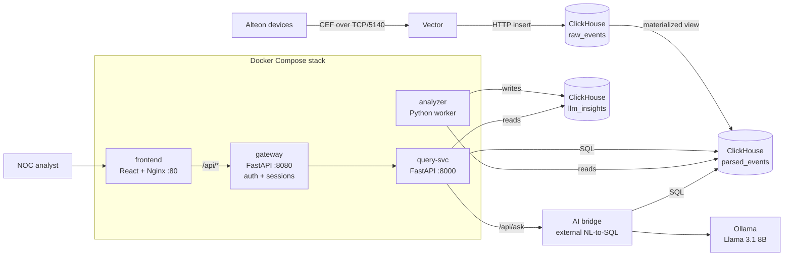

# Alteon NOC Insights

A self-hosted NOC dashboard for **Radware Alteon** HTTP traffic telemetry. Alteon devices stream CEF logs, ClickHouse stores and parses them, and a React portal turns them into live KPIs, charts, top-lists, a service-flow view, rule-based live insights, and an AI assistant that answers natural-language questions about the traffic.

> **Disclaimer:** This is a personal project. It is not an official Radware product and is not supported by Radware. "Radware" and "Alteon" and the Radware logo are trademarks of Radware Ltd.

---

## Features

- **Live dashboard** – throughput, requests, error rate and end-to-end latency KPIs over any time range (15m to 30d, or a custom range).
- **26 widgets** on a drag-and-drop grid: traffic over time, latency breakdown, status codes, RPS, top services / real servers / clients / endpoints, HTTP methods and versions, user agents, content types, geo countries, server RTT, egress paths, Alteon objects, and more. Layout is saved per user.
- **Smart filters** – Alteon device, service, client IP (partial), response code, URI (partial), method, real server, latency bucket, user agent and country. All widgets share the same filter state (AND between fields, OR within a field).
- **Service flow view** – clients → Alteon → real servers, with per-server health and a latency breakdown per hop.
- **Live insights** – a background analyzer compares the last 15 minutes with the previous window and produces structured insight cards (5xx spikes, slow services, unhealthy real servers, heavy clients, problem URIs).
- **AI assistant** – natural-language questions (English and Hebrew) proxied to an external NL-to-SQL bridge backed by a local LLM (Ollama).
- **Auth and audit** – local users with admin / user roles, server-side sessions, and an admin page with sessions and an audit log.
- **Light and dark themes**, RTL-aware chat.

## Architecture



### Services in this repository

| Service | Path | Description |
|---|---|---|
| `frontend` | `frontend/` | React 18 + Vite + Tailwind + Recharts SPA, served by Nginx. Proxies `/api/` to the gateway. The only service exposed on the host. |
| `gateway` | `gateway/` | FastAPI. Login/logout, HttpOnly cookie sessions, users and roles (SQLite at `/data/auth.db`), per-user layout preferences, audit log. Proxies authenticated requests to `query-svc`. |
| `query-svc` | `query-svc/` | FastAPI. Validates filters, builds ClickHouse SQL, returns JSON for every widget. Proxies AI questions to the AI bridge. Optional GeoIP via GeoLite2. |
| `analyzer` | `backend/` | Background worker. Every 5 minutes builds deterministic live-insight cards from `parsed_events` and stores them in `llm_insights`. |

### External components (not in this repository)

| Component | Role |
|---|---|
| **ClickHouse** | Stores `raw_events`, parses them into `parsed_events` with a materialized view, and stores `llm_insights`. |
| **Vector** | Listens for CEF on TCP/5140 and inserts raw lines into `raw_events`. It does no parsing. |
| **AI bridge** | Flask service exposing `POST /api/ask` (NL-to-SQL + answer) and `GET /api/commentary/<id>`. |
| **Ollama** | Local LLM inference used by the AI bridge. |

> The ClickHouse DDL, Vector config and AI bridge are not included yet. The dashboard expects the tables above to exist in the configured database.

## Quick start

**Requirements:** Docker with Compose v2, a reachable ClickHouse with the tables above, and (optionally) the AI bridge.

```bash
git clone https://github.com/<you>/alteon-noc.git
cd alteon-noc

cp .env.example .env        # then edit the values
docker compose up -d --build
```

Create the first admin user (the password is prompted, not echoed):

```bash
docker compose exec -it gateway python -c "import getpass, main; main.init_auth_db(); main.create_user_record('admin', getpass.getpass(), 'admin')"
```

Open `http://<host>:<FRONTEND_PORT>` and log in. Admins can manage users, sessions and the audit log at `/admin`.

### Configuration

All settings come from `.env` (see `.env.example`):

| Variable | Used by | Description |
|---|---|---|
| `CLICKHOUSE_HOST` | query-svc, analyzer | ClickHouse hostname or IP |
| `CLICKHOUSE_PORT` | query-svc, analyzer | ClickHouse HTTP port (default `8123`) |
| `CLICKHOUSE_DB` | query-svc | Database name (default `alteon`) |
| `AI_BRIDGE_URL` | query-svc | Base URL of the AI bridge |
| `FRONTEND_PORT` | frontend | Host port for the portal |
| `GEOIP_DB_PATH` | query-svc | Optional GeoLite2 Country `.mmdb` path inside the container (mount it under `./data/geoip/`) |

Runtime data lives in `./data/` (auth database, GeoIP file) and is git-ignored.

## Repository layout

```
.
├── backend/            analyzer worker (live insights)
├── frontend/           React SPA + Nginx config
│   ├── public/brand/   logo and toolbar icons
│   └── src/
│       ├── App.jsx     dashboard, filters, layout, admin page
│       └── components/ charts, service flow, AI assistant, time range
├── gateway/            auth, sessions, audit, API proxy
├── query-svc/          ClickHouse query API
├── docker-compose.yml
└── .env.example
```

## API overview

All endpoints are under `/api` and require a session, except `/api/health` and `/api/auth/*`.

- **Auth:** `POST /auth/login`, `POST /auth/logout`, `GET /auth/me`
- **Admin:** `GET|POST /admin/users`, `DELETE /admin/users/{id}`, `GET /admin/sessions`, `GET /admin/audit`
- **Dashboard:** `/summary`, `/traffic`, `/transaction-time`, `/status-codes-time`, `/latency-time`, `/rps-time`, `/top-*`, `/service-flow`, `/filter-options`, `/geo-countries`, and more
- **AI:** `POST /ask-ai`, `GET /ai-commentary/{id}`, `GET /latest-insights`

Dashboard endpoints accept `minutes` or `frm`/`to`, plus the filter parameters `host`, `dst_ip`, `client_ip`, `response_code`, `uri`, `method`, `real_server`, `latency`, `user_agent`, `geo_country`.

## Security notes

This project was built for an isolated lab network. Before exposing it anywhere else:

- Put the portal behind TLS (the session cookie is not marked `Secure` over plain HTTP).
- Protect ClickHouse and Ollama with authentication and network ACLs; the services connect to them without credentials.
- Restrict CORS in `query-svc` (currently `*`; only reachable through the gateway by default).
- Consider a stronger password policy and login rate limiting in the gateway.

Found a security issue? Please open a private security advisory rather than a public issue.

## License

No license has been chosen yet, so all rights are reserved by default.
